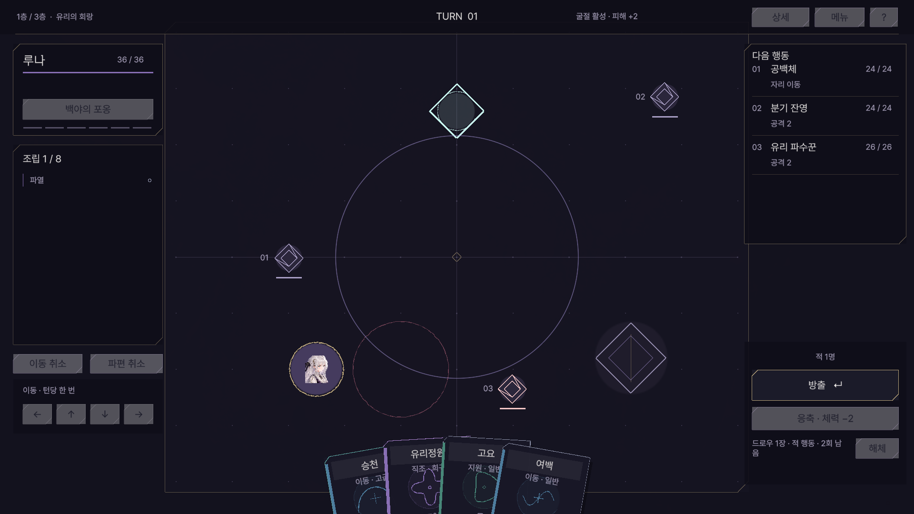

# GRAPHACLYSM

수식 파편 카드를 순서대로 조립하여 그래프를 만들고, 같은 전장의 적에게 피해를 주거나 자신에게 강화를 주는 Unity 덱 빌딩 로그라이트 프로토타입입니다.

성장 UX 1차: 원정 성좌에 기능명·검색·선행 경로 비용 비교, 영구 성장에 목표 단계 묶음 구매를 추가했습니다. 기존 v21 원정과 영구 기록을 유지합니다. 경로 일괄 습득과 영구 재배분은 아직 준비 중입니다. [구현 범위와 남은 작업](Docs/Overhaul/GROWTH_UX_PROGRESS.md).

Overhaul 선행 적용: 기술 조준 중 착지점과 적중·체력/보호막 피해 예측을 표시하고, 잘못된 대상이나 불가능한 착지는 거절합니다. 규칙 21이므로 새 원정에서 확인하세요. 신규 6방 원정은 아직 제작 전입니다. [단계별 상태](Docs/Overhaul/WORK_PLAN.md).

v18: 성장 호버·밑줄 키워드, 위로 뻗는 배치, 탑 지도, 근접 이동, 새 전장 장치/적 패턴/카드와 시작 덱을 적용했습니다. 새 원정에서 확인하세요. [변경 내용과 검증](Docs/ASCENT_PLAYABILITY_V18.md).



## 최신 변경 · v20 전투 대응 실험

1층에 선형 포수·봉인 서기관·연결 수호자를 적 둘씩 조합한 전투 세 종류를 적용했습니다. 그래프로 봉인과 보호 연결을 끊고 사선 옆으로 피하는 대응을 시험합니다. 저장 규칙 20으로 새 원정이 필요합니다. [실제 규칙과 검증](Docs/TACTICAL_THREATS_V20.md).

## v19 후속 수정

노드 개별 해제/비용 반환과 겹친 손패에서 맨 앞 카드 우선 클릭을 적용했습니다. 기존 v19 저장은 유지합니다. [변경과 검증](Docs/NODE_REFUND_CARD_INPUT.md). [전투 재미 개선 기획](Docs/COMBAT_ENGAGEMENT_PROPOSAL.md)은 아직 구현하지 않은 제안입니다.

## 최신 변경 · v19

성장 설명을 클릭으로 고정하고 5단계 투자 문턱과 정렬된 연결선을 적용했습니다. 방 9종·이벤트 10종, 실제 숙련/훈련/보급 보너스, 적 수치 상향, 체력 피해와 보호막 흡수를 구분하는 연출을 추가했습니다. 저장 규칙 19로 새 원정이 필요합니다. [변경 범위와 남은 작업](Docs/PROGRESSION_READABILITY_V19.md).

## 실행

1. 저장소를 복제합니다.
   ```sh
   git clone https://github.com/oscar87657/GRAPHACLYSM.git
   ```
2. Unity Hub에서 복제한 프로젝트 폴더를 추가하고 **Unity 6000.3.23f1**로 엽니다.
3. 패키지 설치와 에셋 임포트가 끝나면 `Assets/Scenes/SampleScene.unity`를 열고 Play합니다.
4. 메인의 카드 사전에서 파편을 살펴보거나, 새 기록 시작 → 이안/루나 선택 → 여정 시작으로 플레이합니다. 저장한 원정은 이어하기를 선택합니다.

## 현재 구현 · v16 기반

- 이전 궤적 전체를 감싸는 수식 파편 31종, 카드별 문양·등급·부가 능력
- 에너지 비용 없이 시작 손패 5장, 보존 손패·조립대 각각 최대 8장
- 방출·체력을 사용하는 응축·해체, 이동과 이동 취소
- 첫 파편이 현재 플레이어 위치에서 시작하는 작도, 적 적중 피해와 자기 적중 강화
- 이벤트·휴식·유물 방과 층별 보스를 포함한 3층 생성 던전, 유물 20종
- 가시·추진·요새화·파열을 포함한 상태 12종과 현재 수치·남은 턴이 보이는 상태 칩
- 3턴 쿨타임 이동 궤적 기술과 처치 초기화·3/5갈래 공격 연출
- 공통 48개와 캐릭터별 96개를 합친 캐릭터당 144노드 변형 성좌 카탈로그
- 핵심 능력 1개·서로 다른 기술군의 전투 기술 2개·궁극기 1개를 분리 장착하는 원정 로드아웃 기반
- 필드에서 반경 1.8 안의 좌표를 직접 고르는 이동, 적·기둥과 겹친 클릭의 가까운 빈 자리 보정
- 패배·완주 잔광으로 올리는 메인 화면 영구 기록과 새 원정 초기화 분리
- 중앙 관문 양쪽의 큰 투명 옆모습 초상, 기본 눈 감음·호버 눈 뜸 연출
- 전체 화면 전장 배경, 1180×944 활성 좌표 필드, 가장자리 오버레이 HUD
- 책장형 카드와 부채꼴 손패, 상세 패널까지 포인터를 옮겨도 유지되는 키워드 설명
- 이동을 막는 기록 기둥과 작도 적중 피해를 높이는 굴절 프리즘
- 행동 후 자동 저장과 이어하기, 이전 저장 백업과 손상 복구
- Esc 일시정지, 저장 후 타이틀·종료, 새 원정의 저장 교체 확인
- 전체/효과음 음량, 창·전체 화면과 해상도, 연출 줄이기, 창 전환 시 일시정지 설정
- 기본 효과음 6종, 5단계 조작 안내, 원정 중 보유 덱·유물 열람

카드 클릭/숫자 1~8로 조립하고 Enter로 방출합니다. Space는 응축, 필드 클릭/방향키는 이동, Backspace는 이동 취소, 우클릭은 파편 취소입니다. K 또는 기술 버튼을 누른 뒤 필드 표식/오른쪽 목록에서 적을 선택하면 캐릭터별 쿨타임 기술이 발동하며, 우클릭으로 대상 지정을 취소합니다. G는 아래에서 위로 성장하는 144노드 단일 트리를 엽니다. 드래그·휠로 이동하고 Ctrl+휠로 확대하며, 노드 선택 후 오른쪽 상세창에서 습득합니다. 상세 설명은 카드 호버와 사전, 전체 조작은 게임의 `?`와 [실행 문서](PROTOTYPE.md)에서 확인할 수 있습니다.

**Esc**로 일시정지하고 **D**로 보유 덱·유물을 확인합니다. **F1 / ?**는 조작 안내입니다. 도움말·설정·덱 목록을 열어도 전투 진행이 멈춥니다. 이어하기 슬롯은 하나이며 손패·조립·이동·응축·보상 선택 상태까지 복원합니다. 패배·완주한 원정은 종료 기록으로 저장합니다. 화면 모드와 해상도는 실행 빌드에서 적용됩니다.

저장 위치와 복구 방식은 [기본 기능 v9](Docs/BASICS_V9.md), 새 전장과 규칙 버전 10은 [전장·카드 UI 개편](Docs/BATTLEFIELD_V10.md), 유물·두 성장 축은 [전투와 성장 v12](Docs/COMBAT_GROWTH_V12.md), 카드·상태 정보는 [전투 정보·성좌 성장 v14](Docs/COMBAT_READABILITY_V14.md), 자유 이동과 기술 대상 지정은 [전투 조작·기술 성좌 v15](Docs/COMBAT_CONTROL_GROWTH_V15.md), 최신 성장 경로는 [아래→위 단일 트리 v17](Docs/ASCENDING_GROWTH_V17.md)에 정리했습니다.

## 개발과 검증

구조는 `Runtime/Presentation → Application → Core`입니다. Unity에서 Test Runner의 EditMode 테스트를 실행할 수 있습니다. 최신 검증은 **156개 테스트 통과**, Full HD/720p 화면 fixture 35장, 게임 Runtime 오류 0건입니다. 자유 좌표 이동·저장 재생, 명시적 기술 대상 지정, 240/144노드 카탈로그, 선행·배타·장착·재배분과 안정 ID 저장을 확인했습니다. 240개 효과가 모두 전투에 구현되었다는 뜻은 아니며, 현재 UI의 `부분 구현/설계 등록` 표시를 기준으로 합니다. Windows 빌드 수동 플레이, 전체 런 밸런스 검증이나 성능 측정 결과를 의미하지 않습니다.

`Assets`와 `.meta`, `Packages`, `ProjectSettings`, 기획 문서를 버전 관리합니다. Unity 캐시·IDE 개인 설정·빌드·`Logs`의 검증 복사본과 백업은 제외합니다. 로그와 상세 캡처의 문서 링크는 개발 PC의 로컬 기록이며 이 저장소에는 대표 화면만 포함합니다. 조사용 원본 이미지는 제외하고 출처 링크와 게임에 필요한 에셋은 유지합니다.

## 문서

- [전체 기획](GAME_DESIGN_DOCUMENT.md)
- [전투 규칙과 수치](COMBAT_REDESIGN.md)
- [실행·조작·검증](PROTOTYPE.md)
- [코드 구조](ARCHITECTURE.md)
- [아트 방향과 출처](ART_DIRECTION.md)
- [v9 저장·메뉴·설정과 검증](Docs/BASICS_V9.md)
- [v10 캐릭터·전장·카드 UI와 지형](Docs/BATTLEFIELD_V10.md)
- [v11 옆모습 캐릭터 선택 연출](Docs/CHARACTER_SELECTION_V11.md)
- [v12 전투·유물·원정/영구 성장](Docs/COMBAT_GROWTH_V12.md)
- [v13 전투 흐름·분기 성장](Docs/COMBAT_FLOW_V13.md)
- [v14 전투 정보·성좌 성장](Docs/COMBAT_READABILITY_V14.md)
- [v15 전투 조작·기술 성좌](Docs/COMBAT_CONTROL_GROWTH_V15.md)
- [v16 대형 변형 성좌 기반](Docs/LARGE_CONSTELLATION_V16.md)
- [개발 재개용 인계와 작업 지침](AGENTS.md)
- [v8 카드 수학 조사](Docs/CARD_RESEARCH_V8.md)

사용 글꼴의 라이선스는 [Docs/FontLicenses](Docs/FontLicenses)에 포함되어 있습니다. 현재는 개발 중인 프로토타입이며 상점·카드 강화·직접 연습하는 실습형 튜토리얼·배경음악은 아직 구현되지 않았습니다. 현재 안내는 5페이지로 구성된 조작 설명입니다.
